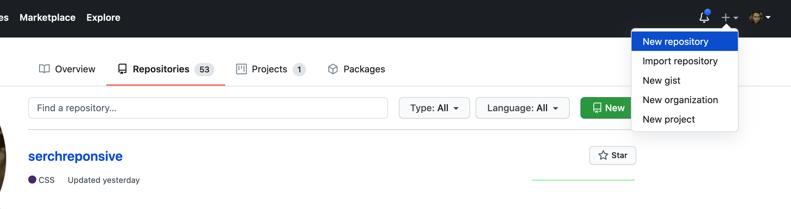
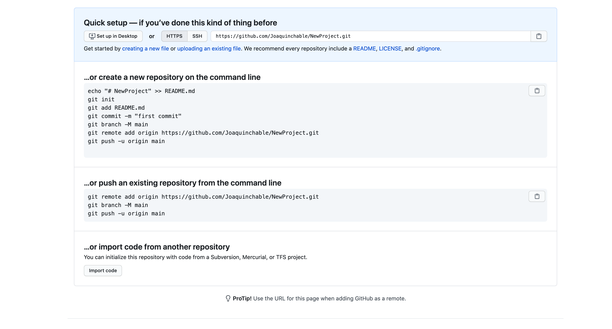
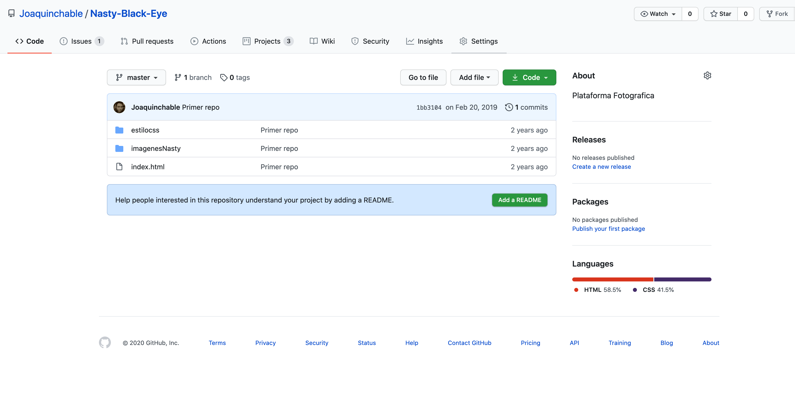
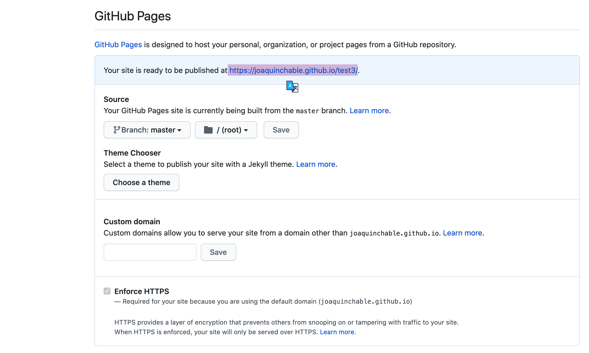

# Subiendo el proyecto a Github Pages

## REQUISITOS
- Tener cuenta en github
- Tener un editor de código instalado

## INSTRUCCIONES

## Crear un Repositorio remoto usando GitHub

  ## Sube tus cambios Usando los comando siguientes

## Revisa tus cambios en tu repositorio remoto en github y vamonis a setings

## Ubica la rama que quieres que se vea  en internet

 
## Copia el tu liga y comparte tu proyecto

 

