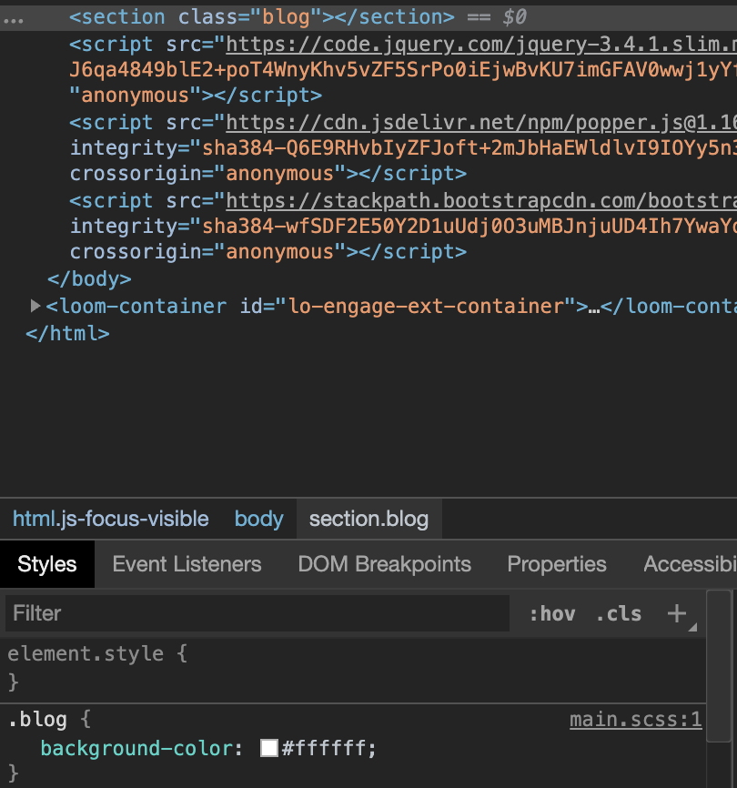

# Sesión: Optimizando la producción de CSS

Sigue el contenido a continuación durante clase para que no te pierdas ningún
detalle de lo que estás a punto de aprender.

## Objetivos

En esta sesión aprenderás:

- Sobre preprocesadores de CSS.
- Optimizar la producción de CSS con Sass.
- Agregar las secciones restantes de la página original de Matcha.
- Desplegar los cambios a nuestra página web hosteada en Netlify.

## Contenido

### Agregando Sass al proyecto

#### Concepto: Preprocesadores de CSS

En las sesiones pasadas hemos venido implementando nuestra página web con HTML
y CSS, y en la última usamos Bootstrap para utilizar componentes preconstruidos
por alguien más, sin embargo eso no significó que dejemos de escribir CSS y dado
que es algo muy común, puede llegar momentos en el que el mantenimiento de
nuestro código CSS sea un poco tedioso. Por ejemplo, el archivo `styles.css` que
estamos usando para nuestro proyecto demo del curso lleva **572 líneas de código**
(imaginamos que el tuyo debería llegar algo similar o incluso más, dependiendo
de las diversas implementaciones que podemos haber realizado para un mismo
problema), adicionalmente encontramos en ciertas secciones código similar a:

```css
.features .feature-card .feature-image figure,
.features .feature-card .feature-image img {
  margin-top: 0;
  height: 100%;
}
```

Este tipo de código puede ser necesario para ser lo más específico posible y no
alterar estilos que no deseamos, pero si modificamos la estructura de nuestro
HTML, modificar estos estilos se puede volver una tarea compleja. Por otro lado,
en muchos selectores distintos hemos usado algunas propiedades similares como
los colores y las fuentes, pero ¿te imaginas que decidamos cambiar de colores o
fuentes? Tendríamos que reemplazar en todos los lugares donde esos valores fueron
usados, para solucionar eso, podríamos hacer uso de variables (actualmente ya
[soportadas de manera nativa en CSS](https://developer.mozilla.org/es/docs/Web/CSS/Using_CSS_custom_properties))
que a través de un lenguaje personalizado que se convierta a CSS a través de un
proceso automatizado podría ser ventajoso para nosotr@s como desaolladores.

Exactamente lo descrito anteriormente es lo que un preprocesador nos permite,
nos provee un lenguaje con habilidades potentes que al final terminan
convirtiéndose a CSS, permitiendo de esta manera que nuestra experiencia de
desarrollo sea más llevadera.

Alguno de los preprocesadores más conocidos son:

- [Sass](https://sass-lang.com/)
- [Less](http://lesscss.org/)
- [Stylus](https://stylus-lang.com/)
- [PostCSS](https://postcss.org/) (aunque no es un preprocesador per sé)

En esta sesión vamos a estar usando Sass, debido a la fácil adaptación que
encontraremos luego de haber visto CSS además de su comunidad que lo respalda
habiendo sido utilizado en varios proyectos muy usados como [Bootstrap](https://getbootstrap.com/docs/4.0/getting-started/theming/#sass).

#### Concepto: Node.js y NPM

En este curso no hemos tenido la oportunidad de interactuar con el lenguaje de
programación llamado JavaScript, el mayor acercamiento ha sido cuando agregamos
los scripts de Bootstrap para que funcione el carousel y que el menú hamburguesa
despliegue las opciones navegación al hacer click sobre el mismo. Sin embargo,
debes de enterarte que JavaScript es un lenguaje que por mucho tiempo se
ejecutaba solo en el navegado a través del uso de la etiqueta `<script></script>`,
pero desde el 2009 la adopción de ejecutar JavaScript en las computadoras sin
necesidad de un navegador fue creciendo más y más. Y el mecanismo de ejecutar
JavaScript en cualquier computador es posible gracias a [Node.js](https://nodejs.org/)
que como tal es un entorno de ejecución de JavaScript instalable en cualquier
ordenador.

Cuando instalas Node.js, viene por defecto con otros programas, uno de ellos es
llamado `npm` (Node Package Manager) que tiene la función de proveer un comando
en la terminal que te permite indicarle qué módulo escrito en JavaScript
queremos usar en nuestro proyecto y el se encarga de buscarlo, descargarlo y
ponerlo disponible para nosotros. Imagínate que le hubieras dicho que quieres
usar Bootstrap en su proyecto, a través de un comando le podrías decir a npm que
vaya y lo descargue por ti y tu solamente agregar la etiqueta `<link />` o
`<script></script>`, a diferencia de como lo hicimos nosotros que fue ir a la
página de la documentación oficial, buscar los links y luego copiar y pegarlos
en el proyecto. Esto no se vuelve escalable cuando usas muchas librerías, y npm
nos ayuda con ese problema.

En nuestro proyecto, como descrito en el prework, deberás haber instalado Node.js
y a través de `npm` haber instalado `sass` como un módulo global, es decir,
disponible para ejecutarlo como un comando en cualquier parte de nuestro
ordenador.

#### Guía: Empezando a estructurar Sass

Sass nos permite detectar dos tipos de archivos, los que tienen extensión `.scss`
ó `.sass`. El primero tiene dicha extensión porque su sintaxis base es muy
similar a la de CSS, mientras que el segundo es una sintaxis particular (por
ejemplo: no usa llaves `{}` para englobar las propiedades de un selector). En
nuestro caso, usaremos la extensión `.scss` porque creemos que te será más fácil
de usar debido a lo que hemos ido aprendiendo en el curso. Dado que vamos a
estar usando diversos archivos de Sass, crearemos una carpeta llamada `scss` a
la misma altura de nuestros archivos principales (`index.html` y `styles.css`) y
aprovecharemos en crear un archivo llamado `main.scss` dentro de esta carpeta.

La estructura de nuestro proyecto debería verse algo así:

```text
.
+-- scss/
+----- main.scss
+-- index.html
+-- styles.css
```

Una vez con la estructura de archivos creada, abre el archivo `main.scss` y
comencemos por escribir una clase para ver un ejemplo de lo que podemos lograr:

```scss
.blog {
  background-color: #ffffff;
}
```

Ahora, ubicado en la raíz del proyecto, vamos a ejecutar el siguiente comando:

```bash
$ pwd # asegúrate de estar en la raíz del proyecto
/ruta/al/proyecto
$ sass --watch scss/main.scss output.css # la salida debería salir algo similar
Compiled scss/main.scss to output.css.
Sass is watching for changes. Press Ctrl-C to stop.
```

Este comando lo que hace es _"escuchar"_ los cambios que realizamos en los
archivos relacionados al `scss/main.scss` y cada vez que guardemos uno, este
generará un archivo llamado `output.css` y `output.css.map` con el código de CSS
que se generó a partir del archivo escrito en Sass.

Por último, para que podamos usar el CSS generado por nuestro código en Sass,
tenemos que agregar enlazar el `output.css` a nuestro HTML de la siguiente
manera:

```html
<!-- index.html -->
<head>
  <!-- Aquí vienen los enlaces a Bootstrap y styles.css -->
  <link rel="stylesheet" type="text/css" href="./styles.css" />
</head>
```

Agreguemos en el HTML la sección del blog que construiremos usando Sass:

```html{3}
<body>
  <!-- Aquí vienen las demás secciones -->
  <section class="blog"></section>
  <!-- Aquí vienen los scripts de Bootstrap -->
</body>
```

Con esto, si inspeccionamos la sección en el devtools veremos que nuestra
sección tiene el fondo de color blanco como lo definimos en el archivo de Sass.



¡Yay! Ya estamos listos para empezar a escribir código en Sass. ¿Te diste cuenta
que el código que escribimos fue exactamente igual que solo CSS? Entonces, ¿cuál
es la ventaja de usarlo? Es lo que vamos a descubrir en el siguiente apartado.

### Creando la sección de blog con Sass

Vamos a constuir el blog de Matcha usando todo lo aprendido hasta el momento y
usando los superpoderes de Sass. Primero, dado que esta sección está dividida en
tres columnas, empecemos por crear la estructura aprovechando el sistema de grid
de Bootstrap:

```html
<section class="container blog">
  <div class="row">
    <div class="col"></div>
    <div class="col"></div>
    <div class="col"></div>
  </div>
</section>
```

#### Guía: Agregando primera columna del blog

De esta manera ya hemos indicado que la sección de blog va a utilizar tres
columnas. Comencemos por agregar el contenido de la primera columna:

```html{4-34}
<section class="container blog">
  <div class="row">
    <div class="col">
      <h2 class="title">Learn how to grow your ecommerce business.</h2>
      <article class="process-list">
        <div class="process">
          <div class="process-icon">
            
          </div>
          <div class="process-description">
            <h3>Build</h3>
            <p>and scale your ecommerce store</p>
          </div>
        </div>
        <div class="process">
          <div class="process-icon">
            
          </div>
          <div class="process-description">
            <h3>Attract</h3>
            <p>your target audience and grow site traffic</p>
          </div>
        </div>
        <div class="process">
          <div class="process-icon">
            
          </div>
          <div class="process-description">
            <h3>Convert</h3>
            <p>readers to subscribers and customers</p>
          </div>
        </div>
      </article>
      <button>Read the blog</button>
    </div>
    <div class="col"></div>
    <div class="col"></div>
  </div>
</section>
```

Hemos ido agregando clases que luego utilizaremos para cambiar la apariencia que
se tiene por defecto.

:::tip

En este caso, estamos usando rutas relativas para las imágenes, si no tienes
estas imágenes las puedes encontrar en:

- [Ícono de build](https://github.com/ivandevp/bedu-fullstack-js/blob/master/docs/sesiones/07-email-bienvenida/end-result/icons/build.svg)
- [Ícono de attract](https://github.com/ivandevp/bedu-fullstack-js/blob/master/docs/sesiones/07-email-bienvenida/end-result/icons/attract.svg)
- [Ícono de convert](https://github.com/ivandevp/bedu-fullstack-js/blob/master/docs/sesiones/07-email-bienvenida/end-result/icons/convert.svg)

Estos íconos fueron guardados en una carpeta `icons` en la raíz del proyecto. Si
utilizas otra ruta para guardar estos íconos asegúrate de cambiarle la ruta
relativa.

:::

Como vemos en el resultado de esta estructura, toma ciertos estilos por defecto
pero que no son exactamente lo que queremos. Vamos a cambiar su apariencia
usando Sass. Empecemos por solucionar el ancho del contenedor de la sección:

```scss
/** main.scss */
.blog {
  background-color: #ffffff;
  max-width: unset;
  padding: 5% 10%;
}
```

Con esto ya tenemos el fondo de color blanco aplicado correctamente a la sección
de blog y también el margen respectivo. Ahora vamos a terminar de crear los
estilos de la primera columna, y podemos percatarnos de que los estilos son muy
similares, es decir, vamos a usar los mismos colores que en otras secciones, así
como tamaño y tipos de fuente. ¿Qué tal si las almacenamos en un único lugar y
que si en algún momento tuviéramos que cambiar el tipo de fuente o color de la
marca, lo haríamos en un solo lugar y no en todos los que usamos? Esto es posible
gracias a que Sass nos provee el uso de [variables](https://sass-lang.com/documentation/variables).

Para esto vamos a crear un archivo llamado `_global.scss` en la carpeta `scss`.

La estructura debería quedar:

```text
.
+-- scss/
+----- _global.scss
+----- main.scss
+-- index.html
+-- styles.css
```

Posteriormente vamos a crear algunas variables para los colores que vamos a
utilizar en esta columna:

```scss
/** _global.scss */
$dark-green-title: #025157;
$dark-green-text: #135359;
$white: #ffffff;
```

Con las variables definidas, podremos usarlas en nuestro `main.scss` haciendo
referencia al nombre de la variable y si en algún momento cambiaran los colores
por un rediseño de marca por ejemplo, solo tendríamos que cambiarlo en nusetro
archivo `_global.scss` y esto afectaría a todos los lugares que la usan.

Por último, vamos a hacer una clase placeholder que otras clases puedan usar
como base, esto lo haremos para el título, ya que la fuente, color y tamaño es
común en otras secciones de la página. Para esto usaremos la funcionalidad de
[extensión o herencia](https://sass-lang.com/documentation/at-rules/extend) que
Sass nos provee. Empecemos por crear una variable para la fuente del título:

```scss{8-9}
/** _global.scss */

/** colores */
$dark-green-title: #025157;
$dark-green-text: #135359;
$white: #ffffff;

/** fuentes */
$font-title: "Alegreya", serif;
```

Y ahora definamos la clase de placeholder:

```scss{11-15}
/** _global.scss */

/** colores */
$dark-green-title: #025157;
$dark-green-text: #135359;
$white: #ffffff;

/** fuentes */
$font-title: "Alegreya", serif;

/** placeholders */
%base-title {
  font-family: $font-title;
  color: $dark-green-text;
}
```

De esta forma ya hemos creado valores que a través de un identificador, podemos
usarla en nuestro código. Probablemente te quede una duda, cómo vamos a hacer
para que nuestro `main.scss` use los valores que hemos definido en otro archivo
llamado `_global.scss`. Para esto aprovecharemos la característica de módulos de
Sass, que a través de una regla llamada [`@use`](https://sass-lang.com/documentation/at-rules/use)
podemos indicar que tenga acceso a las variables definidas en el otro archivo.

Utilicemos `@use` para usar nuestras variables en el archivo `main.scss`:

```scss{2,5}
/** main.scss */
@use 'global' as *;

.blog {
  background-color: $white;
  max-width: unset;
  padding: 5% 10%;
}
```

Dado que `@use` hace uso de un _namespace_ para identificar todas las variables
que se exportan desde el módulo que indicamos, en nuestro caso le hemos puesto
un `*` para no tener que estar escribiendo un nombre de espacio antes de cada
vaiable que queramos usar. A su vez, hicimos la prueba cambiando el color de
fondo de la sección usando la variable `$white` que definimos en el otro archivo.

Ahora si estamos listos para agregar nuestros estilos a la primera columna,
empecemos por el título:

```scss{9-11}
/** main.scss */
@use 'global' as *;

.blog {
  background-color: $white;
  max-width: unset;
  padding: 5% 10%;

  .title {
    @extend %base-title;
  }
}
```

Acá hicimos uso de la regla `@extend` para heredar la clase de placeholder que
definimos en el archivo `_global.scss` y además usamos la funcionalidad de
[`nesting`](https://sass-lang.com/documentation/style-rules/declarations#nesting)
que nos permite definir selectores dentro de otros selectores, esto terminaría
compilándose en el css a `.blog .title` sin la necesidad que nosotros lo
escribamos de dicha forma.

Ahora, pongamos un poco de estilos a la lista de procesos:

```scss{13-20}
/** main.scss */
@use 'global' as *;

.blog {
  background-color: $white;
  max-width: unset;
  padding: 5% 10%;

  .title {
    @extend %base-title;
  }

  .process-list {
    margin-top: 40px;
    margin-bottom: 36px;

    .process {
      margin-bottom: 25px;
    }
  }
}
```

Hemos agregado un poco de espaciado a la lista de procesos y entre cada uno de
los procesos, ahora vamos a definir propiedades específicas para el texto que
está dentro de cada proceso. Usaremos el [`parent selector`](https://sass-lang.com/documentation/style-rules/parent-selector)
de Sass para hacer referencia al selector padrer y aplicar un selector de CSS
más específico:

```scss{20-31}
/** main.scss */
@use 'global' as *;

.blog {
  background-color: $white;
  max-width: unset;
  padding: 5% 10%;

  .title {
    @extend %base-title;
  }

  .process-list {
    margin-top: 40px;
    margin-bottom: 36px;

    .process {
      margin-bottom: 25px;

      & > div {
        & > h3 {
          color: $dark-green-title;
          margin-bottom: 0;
          font-size: 30px;
          font-weight: 500;
        }
        & > p {
          color: $dark-green-text;
          margin: 0;
        }
      }
    }
  }
}
```

Y ahora agreguemos estilos para el ícono de cada uno de los procesos:

```scss{33-42}
/** main.scss */
@use 'global' as *;

.blog {
  background-color: $white;
  max-width: unset;
  padding: 5% 10%;

  .title {
    @extend %base-title;
  }

  .process-list {
    margin-top: 40px;
    margin-bottom: 36px;

    .process {
      margin-bottom: 25px;

      & > div {
        & > h3 {
          color: $dark-green-title;
          margin-bottom: 0;
          font-size: 30px;
          font-weight: 500;
        }
        & > p {
          color: $dark-green-text;
          margin: 0;
        }
      }

      .process-icon {
        width: 60px;
        height: 60px;
        margin-right: 10px;
        text-align: center;

        img {
          height: 100%;
        }
      }
    }
  }
}
```

Por último, agreguemos los estilos del botón:

```scss{33-42}
/** main.scss */
@use 'global' as *;

.blog {
  background-color: $white;
  max-width: unset;
  padding: 5% 10%;

  .title {
    @extend %base-title;
  }

  .process-list {
    margin-top: 40px;
    margin-bottom: 36px;

    .process {
      margin-bottom: 25px;

      & > div {
        & > h3 {
          color: $dark-green-title;
          margin-bottom: 0;
          font-size: 30px;
          font-weight: 500;
        }
        & > p {
          color: $dark-green-text;
          margin: 0;
        }
      }

      .process-icon {
        width: 60px;
        height: 60px;
        margin-right: 10px;
        text-align: center;

        img {
          height: 100%;
        }
      }
    }
  }

  button {
    height: auto;
    border-top-left-radius: 8px;
    border-bottom-left-radius: 8px;
    padding: 12px;
    width: 180px;
    margin-bottom: 15px;
  }
}
```

#### Guía: Agregando segunda columna del blog

Para agregar la segunda columna que viene a ser un post del blog, usaremos un
componente de Bootstrap llamado [card](https://getbootstrap.com/docs/4.4/components/card/).
Al igual que en la sesión de frameworks, agarraremos el código de ejemplo como
base y luego iremos modificando. Sin más, empecemos:

```html
<section class="container blog">
  <div class="row">
    <div class="col">
      <!-- Aquí va la columna de descripción -->
    </div>
    <div class="col">
      <div class="card" style="width: 18rem;">
        
        <div class="card-body">
          <h5 class="card-title">Card title</h5>
          <p class="card-text">
            Some quick example text to build on the card title and make up the
            bulk of the card's content.
          </p>
          <a href="#" class="btn btn-primary">Go somewhere</a>
        </div>
      </div>
    </div>
    <div class="col"></div>
  </div>
</section>
```

Ahora empecemos a cambiar el contenido por lo que necesitamos en la web de
Matcha:

```html{7-35}
<section class="container blog">
  <div class="row">
    <div class="col">
      <!-- Aquí va la columna de descripción -->
    </div>
    <div class="col">
      <div class="card">
        
        <div class="card-body">
          <h5 class="card-title">
            Ecommerce Blogging: The 2020 Guide for Online Stores and DTC Brands
          </h5>
          <p class="metadata">
            <strong class="category">Performance Blogging </strong>
            <strong class="read-time">• 21 mins read</strong>
          </p>
          <p class="card-text">
            Table of ContentsWhy Ecommerce Businesses Need a Blog in
            2020Document Your Ecommerce Blog StrategyPublication: How to Create
            High-Performing Blog ContentDistribution:...
            <span class="read-more">+ <a>Read More</a></span>
          </p>
          <div class="author">
            
            <p>Shauna Ward</p>
          </div>
        </div>
      </div>
    </div>
    <div class="col"></div>
  </div>
</section>
```

Con esta estructura nuestro post va tomando forma. Ahora es momento de
personalizar su apariencia con cambios en Sass.

#### Challenge: Agrega colores usados en las tarjetas

Dentro de las tarjetas de los posts, hay 3 colores distintos para los distintos
textos que tenemos. Usa el devtools para encontrar esos colores y defínelos en
el archivo de `_global.scss`.

<details>
  <summary>Posible solución</summary>

Definimos los colores en `_global.scss`:

```scss{7-9}
/** _global.scss */

/** colores */
$dark-green-title: #025157;
$dark-green-text: #135359;
$white: #ffffff;
$gray: #4a4a4a;
$light-gray: #979797;
$light-green: #67b54b;
```

</details>

Con los colores definidos, podemos ir declarando los estilos que necesitamos
para que nuestra tarjeta quede con los estilos que esperamos. Empecemos con el
título:

```scss{4-7}
/** main.scss */
.blog {
  /** aquí vienen los estilos que definimos para la primera columna */
  .card-title {
    font-size: 24px;
    color: $gray;
  }
}
```

En este caso solo necesitamos cambiar el tamaño de la fuente y el color. Seguido,
cambiemos la apariencia de los metadatos:

```scss{9-17}
/** main.scss */
.blog {
  /** aquí vienen los estilos que definimos para la primera columna */
  .card-title {
    font-size: 24px;
    color: $gray;
  }

  .metadata {
    font-weight: 500;
    font-size: 14px;
    color: $light-gray;

    .category {
      color: $light-green;
    }
  }
}
```

Para estos datos de igual manera, cambiamos el tamaño de la fuente y los colores
que usamos. Ahora, hagamos lo respectivo para el texto del blog post:

```scss{19-29}
/** main.scss */
.blog {
  /** aquí vienen los estilos que definimos para la primera columna */
  .card-title {
    font-size: 24px;
    color: $gray;
  }

  .metadata {
    font-weight: 500;
    font-size: 14px;
    color: $light-gray;

    .category {
      color: $light-green;
    }
  }

  .card-text {
    color: $gray;
    font-size: 18px;
    line-height: 1.5em;
    min-height: 6em;

    .read-more a {
      text-decoration: underline;
      cursor: pointer;
    }
  }
}
```

Para esta parte, nos tocó configurar un poco más sobre todo por el link para
poder indagar más en el blog post. Por último, nos toca cambiar los estilos del
autor:

```html{1}
<div class="author d-flex align-items-center">
  
  <p>Shauna Ward</p>
</div>
```

```scss{31-44}
/** main.scss */
.blog {
  /** aquí vienen los estilos que definimos para la primera columna */
  .card-title {
    font-size: 24px;
    color: $gray;
  }

  .metadata {
    font-weight: 500;
    font-size: 14px;
    color: $light-gray;

    .category {
      color: $light-green;
    }
  }

  .card-text {
    color: $gray;
    font-size: 18px;
    line-height: 1.5em;
    min-height: 6em;

    .read-more a {
      text-decoration: underline;
      cursor: pointer;
    }
  }

  .author {
    & img {
      border-radius: 50%;
      width: 35px;
      height: 35px;
    }

    & p {
      margin-left: 8px;
      font-weight: 600;
      font-size: 14px;
      color: $gray;
    }
  }
}
```

En esta parte, aprovechamos en usar las clases utilitarias de Bootstrap para
estructurar bien el layout del autor a través de propiedades de Flexbox. Y con
estos cambios realizados nuestro blog se debería ver algo como:


#### Challenge: Agrega la tercera columna

Hasta el momento vimos como insertar la primera columna, ahora solo nos falta
agregar la última columna. En general, debido a que estamos usando clases de
Bootstrap y los estilos por clase en nuestro Sass, no deberíamos necesitar de
ningún cambio en el SCSS al menos que nos falte personalizar algo. Es tu turno
de agregar la última columna y quedar listos con el blog.

<details>
  <summary>Posible solución</summary>

En este caso, solo fue necesario agrega la misma estructura y clases que
utilizamos en nuestra segunda columna pero con el texto cambiado:

```html{10-38}
<section class="container blog">
  <div class="row">
    <div class="col">
      <!-- Aquí va la columna de descripción -->
    </div>
    <div class="col">
      <!-- Aquí va la segunda columna -->
    </div>
    <div class="col">
      <div class="card">
        
        <div class="card-body">
          <h5 class="card-title">
            What Is Licensed Content and How Does It Help Your Business Grow?
          </h5>
          <p class="metadata">
            <strong class="category">Performance Blogging </strong>
            <strong class="read-time">• 6 mins read</strong>
          </p>
          <p class="card-text">
            TL;DR: Licensed content, sometimes called syndicated content, is
            content produced by a professional publisher that can be legally
            licensed for...
            <span class="read-more">+ <a>Read More</a></span>
          </p>
          <div class="author d-flex align-items-center">
            
            <p>Rob Glover</p>
          </div>
        </div>
      </div>
    </div>
  </div>
</section>
```

Resultando en algo como:


</details>

En esta sesión hemos visto como crear nuestros estilos con Sass y cómo ciertas
características nos ayudan a agilizar y mejor el desarrollo de nuestro CSS. Como
toda tecnología nueva, siempre tiene una curva de aprendizaje que al inicio
puede aparentar traer más problemas que soluciones, pero una vez que lo
entiendas encontrarás su utilidad. No obstante, recuerda que en las sesiones
nunca nos da el tiempo para explorar todo el abanico de funcionalidades que nos
proveen estas herramientas, por lo que te recomendamos siempre estar revisando
la [documentación oficial](https://sass-lang.com/guide) así como recursos que te
ayuden a practicar lo aprendido.

### Desplegando nuestros cambios

Esto probablemente ya lo has venido haciendo muchas veces, pero no está demás
recordarlo.

Agrega tus cambios realizados a `git`:

```bash
$ git add -A
```

Agrega un mensaje descriptivo a tu nueva versión:

```bash
$ git commit -m "Agrega blog hecho con Sass"
```

Sube tus cambios a Github para que tengas un respaldo y siempre lo puedas
descargar en cualquier otro ordenador:

```bash
$ git push origin <nombre-rama> # `master` si no estás trabajando en otra rama
```

Al realizar este último comando tus cambios estarán reflejados en `Netlify` y
podrás revisar tu web publicada en internet, esperando que se vea algo como (o
incluso mucho mejor):


