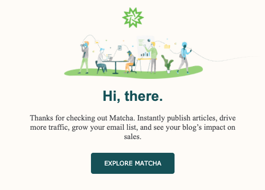
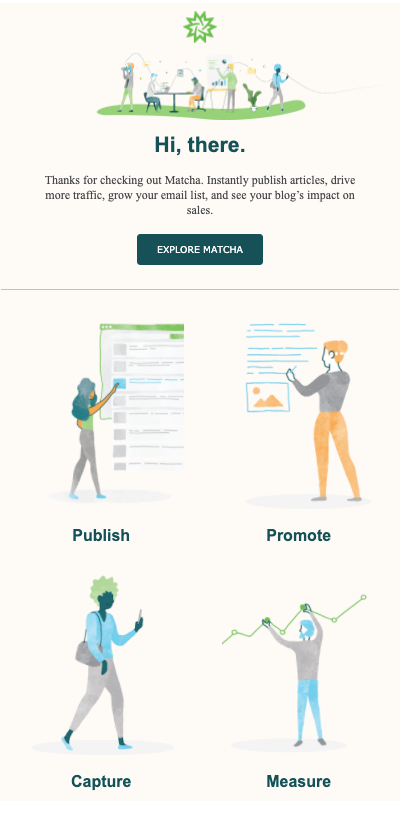
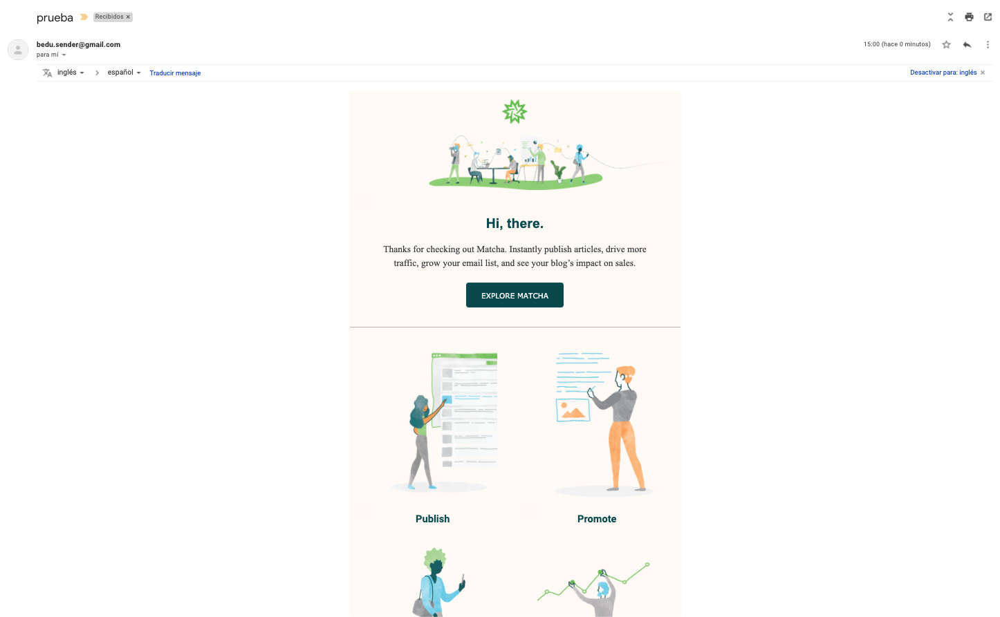
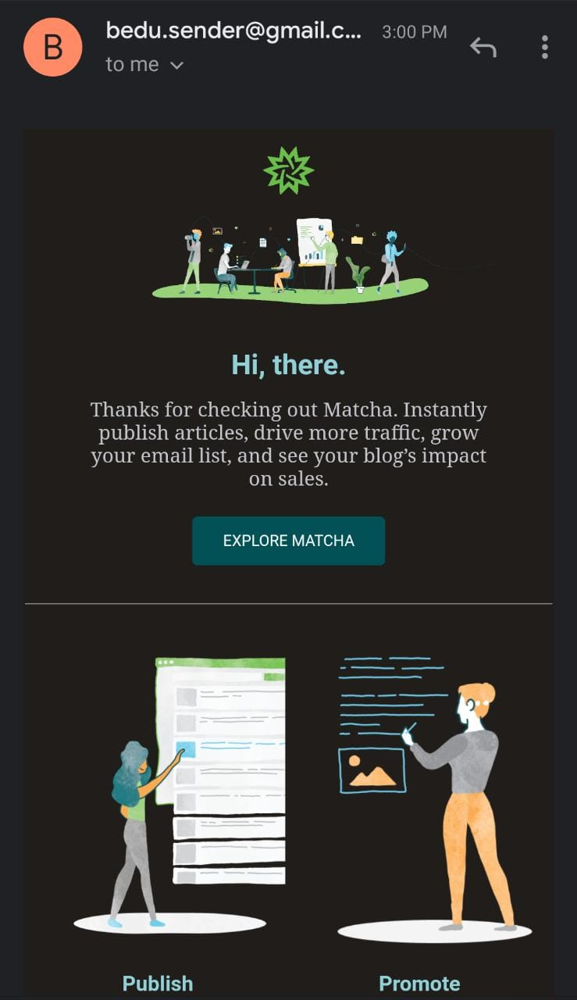

# Sesión: E-mail de bienvenida

Sigue el contenido a continuación durante clase para que no te pierdas ningún
detalle de lo que estás a punto de aprender.

## Objetivos

En esta sesión aprenderás:

- Usar etiquetas de HTML para creación de emails.
- Aplicar estilos en línea para cambiar la apariencia de los emails.
- Agregar funcionalidad a los formularios para enviar los emails de bienvenida
  (guiado).
- Desplegar los cambios a nuestra página web hosteada en Netlify.

## Contenido

En esta sesión aprenderemos cómo crear una plantilla de correo con HTML y CSS
para enviarlo cuando el usuario de click en el botón de enviar de los formularios
de nuestra web, haciendo uso de un servicio que nosotr@s en Bedu hemos creado
para que puedas probar esta funcionalidad.

### Agregando configuración para enviar el email de bienvenida

#### Guía: Homologando los formularios

Dado que tenemos múltiples formularios en nuestra web que invitan al usuario a
dejar su email y suscribirse a nuestros servicios, debemos de homologarlos de
alguna manera para que todos al hacer click en el botón de suscribirse puedan
realizar la misma acción (enviar un correo de bienvenida).

Para lograr este objetivo, podemos asignar una clase a todas las etiquetas
`<form />` o contenedores del formulario en caso de no contar con esta etiqueta.

La clase que vamos a asignar será `signup-form`, dado que el servicio que
agregaremos posteriormente buscará todos los formularios con esta clase para
realizar el envío de correo de bienvenida correctamente.

Debería quedarte algo como:

```html
<form class="signup-form">
  <input type="email" placeholder="Enter email address" />
  <button type="submit">
    Try it now &rarr;
  </button>
</form>
```

#### Guía: Agregando el script que enviará el correo

Una vez que todos los formularios tienen el mismo identificador, agregaremos un
script de JavaScript que se encargará de detectar estos formularios y agregarle
la funcionalidad enviar el correo de bienvenida.

Para esto, debemos de crear un archivo llamado `app.js` al mismo nivel que los
archivos `index.html` y `styles.css`. Posteriormente copiaremos el siguiente
código y lo pegaremos en este nuevo archivo:

```js
// app.js
const $forms = document.querySelectorAll(".signup-form");

const getTemplate = () => {
  return fetch("./template.html").then((response) => response.text());
};

const sendEmailToApi = (address, template) => {
  fetch(`https://bedu-email-sender-api.herokuapp.com/send`, {
    method: "POST",
    headers: {
      "Content-Type": "application/json",
    },
    body: JSON.stringify({
      address: address,
      template: template,
    }),
  })
    .then((results) => {
      console.log(results);
    })
    .catch((error) => {
      console.error(error);
    });
};

const sendEmail = (event) => {
  event.preventDefault();
  const email = event.target.querySelector("input").value;
  getTemplate()
    .then((template) => {
      sendEmailToApi(email, template);
    })
    .catch((error) => {
      console.log(error, "error al convertir el template.");
    });
};

for (let i = 0; i < $forms.length; i++) {
  $forms[i].addEventListener("submit", sendEmail);
}
```

Este script es el código que será responsable de obtener el email que ingrese el
usuario y el template que nosotros crearemos para que se envíe al email.

Para que este script se pueda ejecutar en nuestra página es necesario que lo
agreguemos en nuestro HTML, al igual que hicimos con los scripts de Bootstrap,
debemos de agregalos antes de cerrar la etiqueta `</body>`, haciendo uso de la
etiqueta `<script></script>`. Debemos de agregarlo de la siguiente forma:

```html
<body>
  <!-- Contenido de nuestra página -->
  <script src="./app.js"></script>
</body>
```

Con esto ya tenemos todo listo para dedicarnos a crear nuestra plantilla del
email de bienvenida y probar que se envíe correctamente.

### Creando email de bienvenida

#### Guía: Creación de archivo de plantilla de email

Dado que nuestro script busca el template (plantilla) de nuestro email, debemos
de seguir las convenciones que esta exige para que funcione correctamente, por
lo que vamos a crear un archivo llamado `template.html`, este archivo deberá de
ser creado a la misma altura que los archivos `index.html`, `styles.css` y
`app.js`. La estructura debe verse algo como:

```text
.
+-- app.js
+-- index.html
+-- styles.css
+-- template.html
```

En este archivo escribiremos nuestro HTML y CSS necesario para el email de
bienvenida.

#### Concepto: HTML y CSS para emails

Como visto en el prework, los emails tienen limitaciones en su desarrollo debido
a diversos factores, uno de los principales es que los clientes de correo (por
ejemplo: Gmail, Outlook, Mail de Apple, Yahoo, etc) no son compatibles entre sí
y cada uno tiene su propia implementación de cómo interpretar el HTML y CSS de
un correo. En su mayoría de estos, no siguen el estándar actualizado de HTML,
por lo que esto hace que desarrollar la plantilla de un correo sea complejo y
limitado a etiquetas antiguas para asegurarnos de que funcionará en la mayoría
de clientes de correo.

#### Guía: Creando email de prueba

Comencemos por crear un mensaje de prueba que podamos ver en nuestra bandeja de
entrada. Para esto, debemos de agregar algo de HTML en nuestro archivo
`template.html`.

```html
<!-- Template de email de bienvenida -->
<p>Hola! Este es mi primer email.</p>
```

Para probarlo, vamos a tener que levantar un servidor que se encargue de mostrar
nuestro proyecto, esto debido a que para enviar el correo, nuestra web se tiene
que comunicar con un servidor remoto a través del protocolo HTTP. Aprovecharemos
que instalamos Node.js en la sesión pasada para usar Saas e instalaremos
temporalmente un servidor. Primero, debes de ingresar en tu terminal y asegurarte
que te ubicas en la carpeta del proyecto y luego ejecutar el siguiente comando:

```bash
$ pwd # asegúrate de estar en la ruta del proyecto
/ruta/del/proyecto
$ npx lite-server # esto instalará un servidor de manera temporal
Did not detect a `bs-config.json` or `bs-config.js` override file. Using lite-server defaults...
** browser-sync config **
{ injectChanges: false,
  files: [ './**/*.{html,htm,css,js}' ],
  watchOptions: { ignored: 'node_modules' },
  server:
   { baseDir:
      '.',
     middleware: [ [Function], [Function] ] } }
[Browsersync] Access URLs:
 ------------------------------------
       Local: http://localhost:3000
    External: http://192.168.0.3:3000
 ------------------------------------
          UI: http://localhost:3001
 UI External: http://localhost:3001
 ------------------------------------
[Browsersync] Serving files from: .
[Browsersync] Watching files...
```

`npx` es un software que se instaló junto con Node.js y npm, y lo que hace es
instalar el módulo que nosotros le digamos, en nuestro caso [`lite-server`](https://www.npmjs.com/package/lite-server),
que se encargará de levantar un servidor para nuestro proyecto y nos agilizará
las pruebas dado que si hacemos cambio en nuestros archivos, este servidor
recargará el navegador automáticamente. Probablemente después de que salió el
mensaje en la terminal, te abrió una página en el navegador automáticamente,
dicha página debería estar apuntando a la URL `http://localhost:3000`. Si no se
abrió, asegúrate de abrir manualmente el navegador e ingresar la URL en mención,
el resultado debería ser nuestro proyecto web de Matcha.

!Con esto ya estamos listos! ¿Tú estás list@? Ingresa tu correo electrónico en
el formulario y dale click al botón de suscripción. Luego ingresa a tu bandeja
de entrada, espera un poco y deberías obtener un mensaje de un email llamado
_bedu.sender@gmail.com_ con el mensaje que tu escribiste en el archivo
`template.html` 🎉.


¿Qué te parece si agregamos un poco más de texto y cambiamos un poco su
apariencia?

Vamos a agregar un encabezado para indicar la bienvenida y luego modificaremos
el texto para agradecer al usuario que se suscribió a nuestro servicio.

```html
<h2>¡Bienvenid@!</h2>
<p>
  Gracias por suscribirte a
  <a href="https://fervent-almeida-b80b1e.netlify.com/">Matcha</a>, te
  aseguramos que fue la mejor opción que existe en el mercado para lograr lo que
  estás buscando.
</p>
```

:::tip

Asegúrate de cambiar la url de Matcha por el link de tu proyecto en Netlify.

:::

Enviemos este email de prueba y luego cambiemos su apariencia.


Ahora que tal si incrementamos un poco el tamaño de fuente del párrafo y
cambiamos de colores a los textos. ¿Esto sería con CSS, verdad? Y si bien lo
vamos a usar, la forma será a través del atributo [`style`](https://developer.mozilla.org/en-US/docs/Web/HTML/Global_attributes/style)
en cada una de las etiquetas de HTML que personalicemos.

```html
<h2 style="color: #017374;">¡Bienvenid@!</h2>
<p style="font-size: 16px; color: #1F3B4D;">
  Gracias por suscribirte a
  <a
    href="https://fervent-almeida-b80b1e.netlify.com/"
    style="text-decoration: none; color: #017374; font-weight: 500;"
  >
    Matcha
  </a>
  , te aseguramos que fue la mejor opción que existe en el mercado para lograr
  lo que estás buscando.
</p>
```

¡Wohoo 🥳! Ya logramos poner algo de estilo, prueba tus cambios enviando el
correo, este es el resultado del código de ejemplo:


Ahora es el turno de crear un e-mail un poco más de acorde a lo que hemos ido
construyendo durante este curso, por ello, vamos a desarrollar el siguiente
email de bienvenida:


Empecemos por acomodar todo dentro de una tabla, como hemos revisado en el
prework, las tablas son elementos que nos permiten estructurar nuestra página
web y que garantiza que funcionará en la mayoría de clientes de correo.
Adicionalmente, también es recomendable usar un ancho máximo de `600px` dado que
algunos clientes de correo restringen el ancho a dicha medida. Así que borremos
lo que tenemos en el `template.html` y escribamos lo siguiente:

```html
<table
  style="width: 100%; max-width: 600px; text-align: center; magin: 0 auto;"
>
  <tr>
    <!-- Aquí irá nuestra primera fila -->
  </tr>
</table>
```

Hemos aprovechado en indicar que la alineación de los textos serán centrados,
dado que nuestro diseño así lo usa y también centrar la tabla agregando un margen
automático a los lados. Ahora, para determinar en cuántas filas distribuiremos
nuestras tablas, es relativo, y normalmente puede distribuirse cuando queremos
agrupar distintas porciones de nuestra interfaz. En nuestro caso, vamos a usar 5
filas:

```html{7-18}
<table
  style="width: 100%; max-width: 600px; text-align: center; magin: 0 auto;"
>
  <tr>
    <!-- Aquí irá la imagen del encabezado -->
  </tr>
  <tr>
    <!-- Aquí irá la imagen descriptiva de Matcha -->
  </tr>
  <tr>
    <!-- Aquí irá el texto de bienvenida y el cta -->
  </tr>
  <tr>
    <!-- Aquí irá las características que Matcha provee -->
  </tr>
  <tr>
    <!-- Aquí irá el pie de página con enlaces a redes sociales -->
  </tr>
</table>
```

Comencemos por definir la imagen junto con el enlace al que redirigirá cuando
le hagan click:

```html{2,6-16}
<table
  style="width: 100%; max-width: 600px; text-align: center; margin: 0 auto; background-color: #fffbf7; color: #025157;"
>
  <tr>
    <td>
      <a
        href="https://fervent-almeida-b80b1e.netlify.com/"
        target="_blank"
        style="display:block;"
      >
        
      </a>
    </td>
  </tr>
  <tr>
    <!-- Aquí irá la imagen descriptiva de Matcha -->
  </tr>
  <tr>
    <!-- Aquí irá el texto de bienvenida y el cta -->
  </tr>
  <tr>
    <!-- Aquí irá las características que Matcha provee -->
  </tr>
  <tr>
    <!-- Aquí irá el pie de página con enlaces a redes sociales -->
  </tr>
</table>
```

Hemos aprovechado en ponerle el color de fondo a la tabla genérica y también el
color de el texto. Por otro lado, hemos creado una etiqueta de ancla para
redireccionar a nuestra página de Matcha si en caso el usuario le da click y
hemos insertado la imagen con un ancho específico además de una ligera separación
al elemento superior e inferior.

#### Challenge: Agrega la imagen descriptiva de Matcha para email

Ya vimos como insertar el logo de Matcha para el email, ahora es tu turno de
ingresar la segunda fila con la imagen descriptiva de lo que es Matcha.

El link de la imagen es: `https://getmatcha.com/wp-content/themes/getmatcha/css/../img/home_people.png`.

<details>
  <summary>Posible solución</summary>

```html{20-26}
<table
  style="width: 100%; max-width: 600px; text-align: center; background-color: #fffbf7; color: #025157;"
>
  <tr>
    <td>
      <a
        href="https://fervent-almeida-b80b1e.netlify.com/"
        target="_blank"
        style="display:block;"
      >
        
      </a>
    </td>
  </tr>
  <tr>
    <td>
      
    </td>
  </tr>
  <tr>
    <!-- Aquí irá el texto de bienvenida y el cta -->
  </tr>
  <tr>
    <!-- Aquí irá las características que Matcha provee -->
  </tr>
  <tr>
    <!-- Aquí irá el pie de página con enlaces a redes sociales -->
  </tr>
</table>
```

Resultando en algo como:


</details>

Ahora veamos como agregar el texto de bienvenida y el call to action para que
el usuario visite nuestro sitio. Empecemos por la estructura:

```html{11-20}
<table
  style="width: 100%; max-width: 600px; text-align: center; background-color: #fffbf7; color: #025157;"
>
  <tr>
    <!-- Aquí está el logo de Matcha -->
  </tr>
  <tr>
    <!-- Aquí está la imagen descriptiva de Matcha -->
  </tr>
  <tr>
    <td>
      <h1>Hi, there.</h1>
      <p>
        Thanks for checking out Matcha. Instantly publish articles, drive more
        traffic, grow your email list, and see your blog’s impact on sales.
      </p>
      <a href="https://fervent-almeida-b80b1e.netlify.com/" target="_blank">
        Explore Matcha
      </a>
    </td>
  </tr>
  <tr>
    <!-- Aquí irá las características que Matcha provee -->
  </tr>
  <tr>
    <!-- Aquí irá el pie de página con enlaces a redes sociales -->
  </tr>
</table>
```

Ahora enfoquémonos en esta fila y empecemos a cambiar su apariencia. Primero,
agreguemos un poco de espacio hacia los extremos superior e inferior:

```html{2}
<tr>
  <td style="padding-top: 20px; padding-bottom: 20px">
    <h1>Hi, there.</h1>
    <p>
      Thanks for checking out Matcha. Instantly publish articles, drive more
      traffic, grow your email list, and see your blog’s impact on sales.
    </p>
    <a href="https://fervent-almeida-b80b1e.netlify.com/" target="_blank">
      Explore Matcha
    </a>
  </td>
</tr>
```

Luego, cambiemos la fuente del texto con mayor jerarquía:

```html{3}
<tr>
  <td style="padding-top: 20px; padding-bottom: 20px">
    <h1 style="font-family: Arial, Helvetica, sans-serif;">Hi, there.</h1>
    <p>
      Thanks for checking out Matcha. Instantly publish articles, drive more
      traffic, grow your email list, and see your blog’s impact on sales.
    </p>
    <a href="https://fervent-almeida-b80b1e.netlify.com/" target="_blank">
      Explore Matcha
    </a>
  </td>
</tr>
```

Dado que es un email, debemos de agregar fuentes seguras que funcionen en la
mayoría de clientes de correo y también otras fuentes en caso de que la pimera
no funcione y así sucesivamente.

Ahora cambiemos el color, la fuente y tamaño del texto descriptivo y ajustemos
su ancho para que no abarque todo el espacio disponible.

```html{5}
<tr>
  <td style="padding-top: 20px; padding-bottom: 20px">
    <h1 style="font-family: Arial, Helvetica, sans-serif;">Hi, there.</h1>
    <p
      style="font-family: 'Times New Roman', Times, serif; font-size: 18px; max-width: 80%; margin: 10px auto; color: #46484c;"
    >
      Thanks for checking out Matcha. Instantly publish articles, drive more
      traffic, grow your email list, and see your blog’s impact on sales.
    </p>
    <a href="https://fervent-almeida-b80b1e.netlify.com/" target="_blank">
      Explore Matcha
    </a>
  </td>
</tr>
```

Por último, agreguemos el color de fondo y color de texto, así como el espacio
de relleno del botón para darle la apariencia que deseamos:

```html{10-28}
<tr>
  <td style="padding-top: 20px; padding-bottom: 20px">
    <h1 style="font-family: Arial, Helvetica, sans-serif;">Hi, there.</h1>
    <p
      style="font-family: 'Times New Roman', Times, serif; font-size: 18px; max-width: 80%; margin: 10px auto; color: #46484c;"
    >
      Thanks for checking out Matcha. Instantly publish articles, drive more
      traffic, grow your email list, and see your blog’s impact on sales.
    </p>
    <a
      href="https://fervent-almeida-b80b1e.netlify.com/"
      target="_blank"
      style="
        display: inline-block;
        padding: 15px 30px;
        background-color: #025157;
        color: #ffffff;
        border-radius: 5px;
        text-decoration: none;
        text-transform: uppercase;
        font-family: Verdana, Geneva, Tahoma, sans-serif;
        font-size: 14px;
        margin-top: 15px;
        margin-bottom: 15px;
      "
    >
      Explore Matcha
    </a>
  </td>
</tr>
```

Todos estos cambios resultarían en la siguiente apariencia:



Ahora viene la parte más tediosa del email y donde las tablas toman sentido en
la forma en como vamos a distribuir las características principales de Matcha.
En esta sección, tenemos que insertar una tabla dentro de la celda de la
siguiente fila para poder generar la distribución que deseamos. Empecemos por
agregar la estructura:

```html{14-23}
<table
  style="width: 100%; max-width: 600px; text-align: center; background-color: #fffbf7; color: #025157;"
>
  <tr>
    <!-- Aquí está el logo de Matcha -->
  </tr>
  <tr>
    <!-- Aquí está la imagen descriptiva de Matcha -->
  </tr>
  <tr>
    <!-- Aquí está el texto de bienvenida a Matcha -->
  </tr>
  <tr>
    <td>
      <table>
        <tr>
          <!-- Aquí irá la primera fila de características -->
        </tr>
        <tr>
          <!-- Aquí irá la segunda fila de características -->
        </tr>
      </table>
    </td>
  </tr>
  <tr>
    <!-- Aquí irá el pie de página con enlaces a redes sociales -->
  </tr>
</table>
```

Empecemos por agregar el borde superior e inferior para denotar una separación
de esta sección y también un espaciado entre ellos.

```html{14-21}
<table
  style="width: 100%; max-width: 600px; text-align: center; background-color: #fffbf7; color: #025157;"
>
  <tr>
    <!-- Aquí está el logo de Matcha -->
  </tr>
  <tr>
    <!-- Aquí está la imagen descriptiva de Matcha -->
  </tr>
  <tr>
    <!-- Aquí está el texto de bienvenida a Matcha -->
  </tr>
  <tr>
    <td
      style="
        border-top: 1px solid #999999d1;
        border-bottom: 1px solid #999999d1;
        padding-top: 35px;
        padding-bottom: 35px;
      "
    >
      <table>
        <tr>
          <!-- Aquí irá la primera fila de características -->
        </tr>
        <tr>
          <!-- Aquí irá la segunda fila de características -->
        </tr>
      </table>
    </td>
  </tr>
  <tr>
    <!-- Aquí irá el pie de página con enlaces a redes sociales -->
  </tr>
</table>
```

Ahora insertemos la estructura de la primera fila:

```html{24-37}
<table
  style="width: 100%; max-width: 600px; text-align: center; background-color: #fffbf7; color: #025157;"
>
  <tr>
    <!-- Aquí está el logo de Matcha -->
  </tr>
  <tr>
    <!-- Aquí está la imagen descriptiva de Matcha -->
  </tr>
  <tr>
    <!-- Aquí está el texto de bienvenida a Matcha -->
  </tr>
  <tr>
    <td
      style="
        border-top: 1px solid #999999d1;
        border-bottom: 1px solid #999999d1;
        padding-top: 35px;
        padding-bottom: 35px;
      "
    >
      <table>
        <tr>
          <td>
            
            <h2>Publish</h2>
          </td>
          <td>
            
            <h2>Promote</h2>
          </td>
        </tr>
        <tr>
          <!-- Aquí irá la segunda fila de características -->
        </tr>
      </table>
    </td>
  </tr>
  <tr>
    <!-- Aquí irá el pie de página con enlaces a redes sociales -->
  </tr>
</table>
```

Con esto las imágenes no se verán del tamaño que nosotros deseamos, pongamos un
límite en el alto y dado que cada celda debería ocupar la mitad del espacio
disponible, podemos asignarle un ancho de la mitad de su contenedor:

```html{24,26,32,34}
<table
  style="width: 100%; max-width: 600px; text-align: center; background-color: #fffbf7; color: #025157;"
>
  <tr>
    <!-- Aquí está el logo de Matcha -->
  </tr>
  <tr>
    <!-- Aquí está la imagen descriptiva de Matcha -->
  </tr>
  <tr>
    <!-- Aquí está el texto de bienvenida a Matcha -->
  </tr>
  <tr>
    <td
      style="
        border-top: 1px solid #999999d1;
        border-bottom: 1px solid #999999d1;
        padding-top: 35px;
        padding-bottom: 35px;
      "
    >
      <table>
        <tr>
          <td style="width: 50%">
            
            <h2>Publish</h2>
          </td>
          <td style="width: 50%">
            
            <h2>Promote</h2>
          </td>
        </tr>
        <tr>
          <!-- Aquí irá la segunda fila de características -->
        </tr>
      </table>
    </td>
  </tr>
  <tr>
    <!-- Aquí irá el pie de página con enlaces a redes sociales -->
  </tr>
</table>
```

Ahora nos falta centrar el texto e imágenes, además de cambiar el color y tipo
de fuente paa el texto:

```html{22-29}
<table
  style="width: 100%; max-width: 600px; text-align: center; background-color: #fffbf7; color: #025157;"
>
  <tr>
    <!-- Aquí está el logo de Matcha -->
  </tr>
  <tr>
    <!-- Aquí está la imagen descriptiva de Matcha -->
  </tr>
  <tr>
    <!-- Aquí está el texto de bienvenida a Matcha -->
  </tr>
  <tr>
    <td
      style="
        border-top: 1px solid #999999d1;
        border-bottom: 1px solid #999999d1;
        padding-top: 35px;
        padding-bottom: 35px;
      "
    >
      <table
        style="
          text-align: center;
          width: 100%;
          color: #025157;
          font-family: Arial, Helvetica, sans-serif;
        "
      >
        <tr>
          <td style="width: 50%">
            
            <h2>Publish</h2>
          </td>
          <td style="width: 50%">
            
            <h2>Promote</h2>
          </td>
        </tr>
        <tr>
          <!-- Aquí irá la segunda fila de características -->
        </tr>
      </table>
    </td>
  </tr>
  <tr>
    <!-- Aquí irá el pie de página con enlaces a redes sociales -->
  </tr>
</table>
```

#### Challenge: Agregando segunda fila de características de Matcha

Genial, ahora que ya hemos visto como distribuir en 2 columnas las
características principales de Matcha, agrega la segunda fila para terminar esta
sección.

<details>
  <summary>Posible solución</summary>

En este caso tenemos que agregar 2 celdas a la segunda fila y ponerle los mismos
estilos a las imágenes y las celdas para que queden distribuidas tal cual las
primeras:

```html{49-64}
<table
  style="width: 100%; max-width: 600px; text-align: center; background-color: #fffbf7; color: #025157;"
>
  <tr>
    <!-- Aquí está el logo de Matcha -->
  </tr>
  <tr>
    <!-- Aquí está la imagen descriptiva de Matcha -->
  </tr>
  <tr>
    <!-- Aquí está el texto de bienvenida a Matcha -->
  </tr>
  <tr>
    <td
      style="
        border-top: 1px solid #999999d1;
        border-bottom: 1px solid #999999d1;
        padding-top: 35px;
        padding-bottom: 35px;
      "
    >
      <table
        style="
          text-align: center;
          width: 100%;
          color: #025157;
          font-family: Arial, Helvetica, sans-serif;
        "
      >
        <tr>
          <td style="width: 50%">
            
            <h2>Publish</h2>
          </td>
          <td style="width: 50%">
            
            <h2>Promote</h2>
          </td>
        </tr>
        <tr>
          <td>
            
            <h2>Capture</h2>
          </td>
          <td>
            
            <h2>Measure</h2>
          </td>
        </tr>
      </table>
    </td>
  </tr>
  <tr>
    <!-- Aquí irá el pie de página con enlaces a redes sociales -->
  </tr>
</table>
```

</details>

Con esto ya estamos casi listos con nuestro email, debería de verse algo como:



#### Challenge: Agregar última sección de email de bienvenida

Para cerrar con broche de oro este curso, te tocará implementar el footer del
email de bienvenida, esto significa agregar el código necesario paa la última
fila de la tabla que estructura nuestro correo de bienvenida.

Para esto deberás insertar imágenes que estén dentro de enlaces para
redireccionar a los usuarios cuando hagan click. Si deseas usar las mismas
imágenes que te mostramos al inicio puedes usar los siguientes links:

- [Ícono de Instagram](https://images.vexels.com/media/users/3/137380/isolated/preview/1b2ca367caa7eff8b45c09ec09b44c16-icono-de-instagram-logo-by-vexels.png)
- [Ícono de Twitter](https://images.vexels.com/media/users/3/137419/isolated/preview/b1a3fab214230557053ed1c4bf17b46c-icono-de-twitter-logo-by-vexels.png)
- [Ícono de Facebook](https://images.vexels.com/media/users/3/137253/isolated/preview/90dd9f12fdd1eefb8c8976903944c026-icono-de-facebook-logo-by-vexels.png)
- [Ícono de LinkedIn](https://images.vexels.com/media/users/3/140687/isolated/preview/f705441ceeb70b9920ce6c37d80f5603-linkedin-distorsionado-icono-redondo-by-vexels.png)

- [Link de Instagram](https://www.instagram.com/matchacontent)
- [Link de Twitter](https://twitter.com/matchacontent)
- [Link de Facebook](https://www.facebook.com/matchacontent/)
- [Link de LinkedIn](https://linkedin.com/company/matchacontent)

La fuente que usamos en el ejemplo es: `'Times New Roman', Times, serif`.

<details>
  <summary>Posible solución</summary>

```html
<tr>
  <td
    style="
      padding-top: 20px;
      padding-bottom: 20px;
      font-family: 'Times New Roman', Times, serif;
      color: #46484c;
      font-size: 16px;
    "
  >
    <p>Follow us on:</p>
    <div>
      <a
        href="https://www.instagram.com/matchacontent"
        style="display: inline-block; width: 50px; height: 50px;"
      >
        
      </a>
      <a
        href="https://www.facebook.com/matchacontent/"
        style="display: inline-block; width: 50px; height: 50px;"
      >
        
      </a>
      <a
        href="https://twitter.com/matchacontent"
        style="display: inline-block; width: 50px; height: 50px;"
      >
        
      </a>
      <a
        href="https://linkedin.com/company/matchacontent"
        style="display: inline-block; width: 50px; height: 50px;"
      >
        
      </a>
    </div>
    <p>
      © 2020 Matcha. All Rights Reserved
    </p>
  </td>
</tr>
```

</details>

El código final de este correo de bienvenida podría ser similar a:

```html
<table
  style="
    width: 100%;
    max-width: 600px;
    text-align: center;
    background-color: #fffbf7;
    color: #025157;
    margin: 0 auto;
  "
>
  <tr>
    <td>
      <a
        href="https://fervent-almeida-b80b1e.netlify.com/"
        target="_blank"
        style="display: block;"
      >
        
      </a>
    </td>
  </tr>
  <tr>
    <td>
      
    </td>
  </tr>
  <tr>
    <td style="padding-top: 20px; padding-bottom: 20px;">
      <h1 style="font-family: Arial, Helvetica, sans-serif;">Hi, there.</h1>
      <p
        style="
          font-family: 'Times New Roman', Times, serif;
          font-size: 18px;
          max-width: 80%;
          margin: 10px auto;
          color: #46484c;
        "
      >
        Thanks for checking out Matcha. Instantly publish articles, drive more
        traffic, grow your email list, and see your blog’s impact on sales.
      </p>
      <a
        href="https://fervent-almeida-b80b1e.netlify.com/"
        target="_blank"
        style="
          display: inline-block;
          padding: 15px 30px;
          background-color: #025157;
          color: #ffffff;
          border-radius: 5px;
          text-decoration: none;
          text-transform: uppercase;
          font-family: Verdana, Geneva, Tahoma, sans-serif;
          font-size: 14px;
          margin-top: 15px;
          margin-bottom: 15px;
        "
      >
        Explore Matcha
      </a>
    </td>
  </tr>
  <tr>
    <td
      style="
        border-top: 1px solid #999999d1;
        border-bottom: 1px solid #999999d1;
        padding-top: 35px;
        padding-bottom: 35px;
      "
    >
      <table
        style="
          text-align: center;
          width: 100%;
          color: #025157;
          font-family: Arial, Helvetica, sans-serif;
        "
      >
        <tr>
          <td style="width: 50%;">
            
            <h2>Publish</h2>
          </td>
          <td style="width: 50%;">
            
            <h2>Promote</h2>
          </td>
        </tr>
        <tr>
          <td>
            
            <h2>Capture</h2>
          </td>
          <td>
            
            <h2>Measure</h2>
          </td>
        </tr>
      </table>
    </td>
  </tr>
  <tr>
    <td
      style="
        padding-top: 20px;
        padding-bottom: 20px;
        font-family: 'Times New Roman', Times, serif;
        color: #46484c;
        font-size: 16px;
      "
    >
      <p>Follow us on:</p>
      <div>
        <a
          href="https://www.instagram.com/matchacontent"
          style="display: inline-block; width: 50px; height: 50px;"
        >
          
        </a>
        <a
          href="https://www.facebook.com/matchacontent/"
          style="display: inline-block; width: 50px; height: 50px;"
        >
          
        </a>
        <a
          href="https://twitter.com/matchacontent"
          style="display: inline-block; width: 50px; height: 50px;"
        >
          
        </a>
        <a
          href="https://linkedin.com/company/matchacontent"
          style="display: inline-block; width: 50px; height: 50px;"
        >
          
        </a>
      </div>
      <p>
        © 2020 Matcha. All Rights Reserved
      </p>
    </td>
  </tr>
</table>
```

Y verse algo similar a:


### Desplegando nuestros cambios

Esto probablemente ya lo has venido haciendo muchas veces, pero no está demás
recordarlo.

Agrega tus cambios realizados a `git`:

```bash
$ git add -A
```

Agrega un mensaje descriptivo a tu nueva versión:

```bash
$ git commit -m "Agrega plantilla de correo de bienvenida"
```

Sube tus cambios a Github para que tengas un respaldo y siempre lo puedas
descargar en cualquier otro ordenador:

```bash
$ git push origin <nombre-rama> # `master` si no estás trabajando en otra rama
```

Al realizar este último comando tus cambios estarán reflejados en `Netlify` y
podrás revisar tu web publicada en internet. No te esperes más e ingresa tu
correo y mira lo cool que se ve en tu bandeja, tanto desde móvil como desde
desktop:




