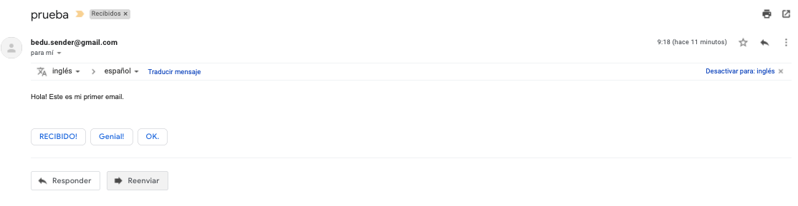
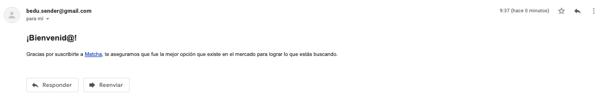
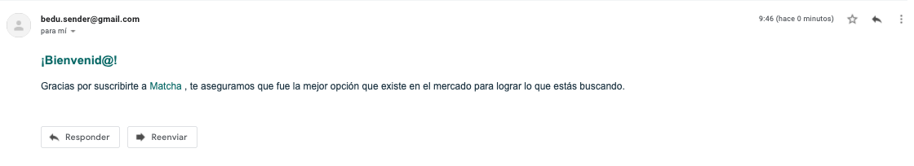
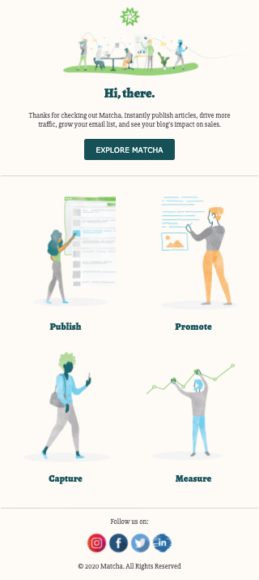

# Creando email de prueba

Comencemos por crear un mensaje de prueba que podamos ver en nuestra bandeja de
entrada. Para esto, debemos de agregar algo de HTML en nuestro archivo
`template.html`.

```html
<!-- Template de email de bienvenida -->
<p>Hola! Este es mi primer email.</p>
```

Para probarlo, vamos a tener que levantar un servidor que se encargue de mostrar
nuestro proyecto, esto debido a que para enviar el correo, nuestra web se tiene
que comunicar con un servidor remoto a través del protocolo HTTP. Aprovecharemos
que instalamos Node.js en la sesión pasada para usar Saas e instalaremos
temporalmente un servidor. Primero, debes de ingresar en tu terminal y asegurarte
que te ubicas en la carpeta del proyecto y luego ejecutar el siguiente comando:

```bash
$ pwd # asegúrate de estar en la ruta del proyecto
/ruta/del/proyecto
$ npx lite-server # esto instalará un servidor de manera temporal
Did not detect a `bs-config.json` or `bs-config.js` override file. Using lite-server defaults...
** browser-sync config **
{ injectChanges: false,
  files: [ './**/*.{html,htm,css,js}' ],
  watchOptions: { ignored: 'node_modules' },
  server:
   { baseDir:
      '.',
     middleware: [ [Function], [Function] ] } }
[Browsersync] Access URLs:
 ------------------------------------
       Local: http://localhost:3000
    External: http://192.168.0.3:3000
 ------------------------------------
          UI: http://localhost:3001
 UI External: http://localhost:3001
 ------------------------------------
[Browsersync] Serving files from: .
[Browsersync] Watching files...
```

`npx` es un software que se instaló junto con Node.js y npm, y lo que hace es
instalar el módulo que nosotros le digamos, en nuestro caso [`lite-server`](https://www.npmjs.com/package/lite-server),
que se encargará de levantar un servidor para nuestro proyecto y nos agilizará
las pruebas dado que si hacemos cambio en nuestros archivos, este servidor
recargará el navegador automáticamente. Probablemente después de que salió el
mensaje en la terminal, te abrió una página en el navegador automáticamente,
dicha página debería estar apuntando a la URL `http://localhost:3000`. Si no se
abrió, asegúrate de abrir manualmente el navegador e ingresar la URL en mención,
el resultado debería ser nuestro proyecto web de Matcha.

!Con esto ya estamos listos! ¿Tú estás list@? Ingresa tu correo electrónico en
el formulario y dale click al botón de suscripción. Luego ingresa a tu bandeja
de entrada, espera un poco y deberías obtener un mensaje de un email llamado
_bedu.sender@gmail.com_ con el mensaje que tu escribiste en el archivo
`template.html` 🎉.



¿Qué te parece si agregamos un poco más de texto y cambiamos un poco su
apariencia?

Vamos a agregar un encabezado para indicar la bienvenida y luego modificaremos
el texto para agradecer al usuario que se suscribió a nuestro servicio.

```html
<h2>¡Bienvenid@!</h2>
<p>
  Gracias por suscribirte a
  <a href="https://fervent-almeida-b80b1e.netlify.com/">Matcha</a>, te
  aseguramos que fue la mejor opción que existe en el mercado para lograr lo que
  estás buscando.
</p>
```

:::tip

Asegúrate de cambiar la url de Matcha por el link de tu proyecto en Netlify.

:::

Enviemos este email de prueba y luego cambiemos su apariencia.



Ahora que tal si incrementamos un poco el tamaño de fuente del párrafo y
cambiamos de colores a los textos. ¿Esto sería con CSS, verdad? Y si bien lo
vamos a usar, la forma será a través del atributo [`style`](https://developer.mozilla.org/en-US/docs/Web/HTML/Global_attributes/style)
en cada una de las etiquetas de HTML que personalicemos.

```html
<h2 style="color: #017374;">¡Bienvenid@!</h2>
<p style="font-size: 16px; color: #1F3B4D;">
  Gracias por suscribirte a
  <a
    href="https://fervent-almeida-b80b1e.netlify.com/"
    style="text-decoration: none; color: #017374; font-weight: 500;"
  >
    Matcha
  </a>
  , te aseguramos que fue la mejor opción que existe en el mercado para lograr
  lo que estás buscando.
</p>
```

¡Wohoo 🥳! Ya logramos poner algo de estilo, prueba tus cambios enviando el
correo, este es el resultado del código de ejemplo:



Ahora es el turno de crear un e-mail un poco más de acorde a lo que hemos ido
construyendo durante este curso, por ello, vamos a desarrollar el siguiente
email de bienvenida:



Empecemos por acomodar todo dentro de una tabla, como hemos revisado en el
prework, las tablas son elementos que nos permiten estructurar nuestra página
web y que garantiza que funcionará en la mayoría de clientes de correo.
Adicionalmente, también es recomendable usar un ancho máximo de `600px` dado que
algunos clientes de correo restringen el ancho a dicha medida. Así que borremos
lo que tenemos en el `template.html` y escribamos lo siguiente:

```html
<table
  style="width: 100%; max-width: 600px; text-align: center; magin: 0 auto;"
>
  <tr>
    <!-- Aquí irá nuestra primera fila -->
  </tr>
</table>
```

Hemos aprovechado en indicar que la alineación de los textos serán centrados,
dado que nuestro diseño así lo usa y también centrar la tabla agregando un margen
automático a los lados. Ahora, para determinar en cuántas filas distribuiremos
nuestras tablas, es relativo, y normalmente puede distribuirse cuando queremos
agrupar distintas porciones de nuestra interfaz. En nuestro caso, vamos a usar 5
filas:

```html{7-18}
<table
  style="width: 100%; max-width: 600px; text-align: center; magin: 0 auto;"
>
  <tr>
    <!-- Aquí irá la imagen del encabezado -->
  </tr>
  <tr>
    <!-- Aquí irá la imagen descriptiva de Matcha -->
  </tr>
  <tr>
    <!-- Aquí irá el texto de bienvenida y el cta -->
  </tr>
  <tr>
    <!-- Aquí irá las características que Matcha provee -->
  </tr>
  <tr>
    <!-- Aquí irá el pie de página con enlaces a redes sociales -->
  </tr>
</table>
```

Comencemos por definir la imagen junto con el enlace al que redirigirá cuando
le hagan click:

```html{2,6-16}
<table
  style="width: 100%; max-width: 600px; text-align: center; margin: 0 auto; background-color: #fffbf7; color: #025157;"
>
  <tr>
    <td>
      <a
        href="https://fervent-almeida-b80b1e.netlify.com/"
        target="_blank"
        style="display:block;"
      >
        
      </a>
    </td>
  </tr>
  <tr>
    <!-- Aquí irá la imagen descriptiva de Matcha -->
  </tr>
  <tr>
    <!-- Aquí irá el texto de bienvenida y el cta -->
  </tr>
  <tr>
    <!-- Aquí irá las características que Matcha provee -->
  </tr>
  <tr>
    <!-- Aquí irá el pie de página con enlaces a redes sociales -->
  </tr>
</table>
```

Hemos aprovechado en ponerle el color de fondo a la tabla genérica y también el
color de el texto. Por otro lado, hemos creado una etiqueta de ancla para
redireccionar a nuestra página de Matcha si en caso el usuario le da click y
hemos insertado la imagen con un ancho específico además de una ligera separación
al elemento superior e inferior.
